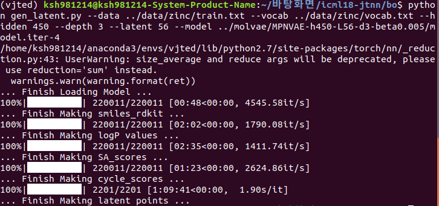

# Bayesian Optimization, Use tqdm

For Bayesian optimization, we used the scripts from https://github.com/mkusner/grammarVAE

This requires you to install their customized Theano library. 
Please see https://github.com/mkusner/grammarVAE#bayesian-optimization for installation.

## Usage
First generate the latent representation of all training molecules:
```
python gen_latent.py --data ../data/zinc/train.txt --vocab ../data/zinc/vocab.txt --hidden 450 --depth 3 --latent 56 --model ../molvae/MPNVAE-h450-L56-d3-beta0.005/model.iter-4
```
This generates **latent_features.txt for latent vectors and other files for logP, synthetic accessability scores(targets.txt, logP_values.txt, SA_scores.txt, cycle_scores.txt)**



- local 기준

To run Bayesian optimization:
```
SEED=1
mkdir results$SEED
python run_bo.py --vocab ../data/zinc/vocab.txt --model ../molvae/MPNVAE-h450-L56-d3-beta0.005/model.iter-4 --save_dir results$SEED --hidden 450 --depth 3 --latent 56 --seed $SEED 

```
It performs five iterations of Bayesian optimization with EI heuristics, and saves discovered molecules in `results$SEED/` 
Following previous work, we tried `$SEED` from 1 to 10.

run_bo.py에서 latent representation m을 준다면 y(m)을 예측하는 a sparse Gaussian process(SGP)를 학습시킨다.

- y(m) = logP(m) - SA(m) - cycle(m)
    - SA(m)은 synthetic accessibility score 
    - cycle(m)은 6개 원자 이상을 가지는 ring의 count

최종적으로, valid_smiles.dat과 scores.dat을 저장한다.

여기서, theano라는 라이브러리를 깔아주어야하는데, 기존 latest버전으로는 해결할 수 없다.
따라서, [gVAE](https://github.com/mkusner/grammarVAE) 의 /Theano-master 로 들어가서 폴더를 /bo에 다운 받은 후
```
python setup.py install
```
을 실행해주어야한다.


To summarize results accross 10 runs:
```
python print_result.py
```
