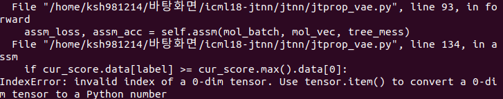
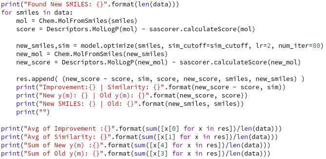
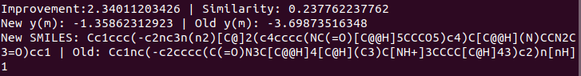

# Constrained Molecule Optimization
Suppose the repository is downloaded at `$PREFIX/icml18-jtnn` directory. First set up environment variables:
```
export PYTHONPATH=$PREFIX/icml18-jtnn
```

## Training
We trained VAE model in two phases:
1. We train our model for three epochs without **KL regularization term** (So we are essentially training an autoencoder).
Pretrain our model as follows (with hidden state dimension=420, latent code dimension=56, graph message passing depth=3):
```
mkdir pre_model/
CUDA_VISIBLE_DEVICES=1 nohup python pretrain.py --train ../data/zinc/train.txt --vocab ../data/zinc/vocab.txt --prop ../data/zinc/train.logP-SA --hidden 420 --depth 3 --latent 56 --batch 20 --save_dir pre_model/ > ./pre_model/molopt_pretrain.out &

```
PyTorch by default uses all GPUs, setting flag `CUDA_VISIBLE_DEVICES=0` forces PyTorch to use the first GPU (1 for second GPU and so on).

The final model is saved at pre_model/model.2

### Error in Pretraining



- /jtnn/jtprop_vae.py line 134 수정 (+ .data[0]으로 되어있는 부분 모두 수정)

2. Train out model with KL regularization, **with constant regularization weight $beta$**. 
We found setting beta > 0.01 greatly damages reconstruction accuracy.
```
mkdir vae_model/
CUDA_VISIBLE_DEVICES=0 python vaetrain.py --train ../data/zinc/train.txt --vocab ../data/zinc/vocab.txt --prop ../data/zinc/train.logP-SA \
--hidden 420 --depth 3 --latent 56 --batch 40 --lr 0.0007 --beta 0.005 \
--model pre_model/model.2 --save_dir vae_model/
```

## Testing

test셋(800개)에서를 새로운 SMILE로 변환 

To optimize a set of molecules, run
```
CUDA_VISIBLE_DEVICES=1 nohup python optimize.py --test ../data/zinc/opt.test.logP-SA --vocab ../data/zinc/vocab.txt --hidden 420 --depth 3 --latent 56 --sim 0.2 --model joint-h420-L56-d3-beta0.005/model.iter-4 > optimize.out
```
Replace `opt.test.log-SA` with `opt.valid.log-SA` for validation.


- 기존 코드를 수정
- y(m) = logP(m) - SA(m)
- test도 메모리를 약 4기가 차지함정



- 이런식으로 **n** 개가 나옴.
